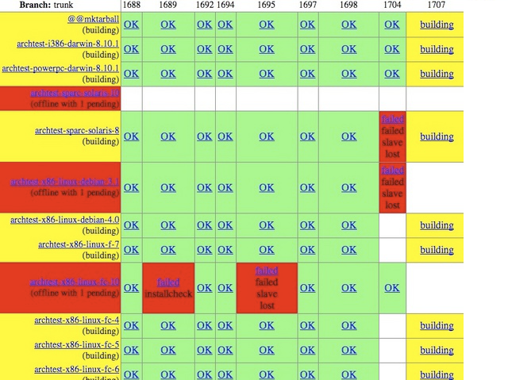

Level 2 : Stage de fin d'études
===============================

.. figure:: /_static/2up.png
   :class: center

Caractéristiques
================

.. rst-class:: build

- Projet : Logiciel de configuration d'accès à distance pour télétravail
- Ressources : 3 élèves ingénieurs
- Clients : équipe de R&D de l'entreprise, maître de stage, jury de soutenance
- Contraintes de temps : fixée par la fin de l'année

Etapes du projet
================

.. rst-class:: build

- Rétroplanning (diagramme de Gantt)
- Traduction de la problématique en spécifications techniques
- Validation avec le maître de stage et le référent entreprise
- Chacun code sa partie, à partir des specs
- En cours de projet, on demande au client de vérifier les choix d'implémentation

.. note::

   * séparation en partie graphique, partie serveur et génération des fichiers de conf, partie sécurité et configuration d'OpenVPN
   * dans les specs, on définit précisément comment les parties vont s'intégrer

Etapes du projet
================

.. rst-class:: build

- Chacun code des tests automatiques sur chaque partie
- On intègre à la fin du projet
- On valide par des tests et auprès du client et du maître de stage

Problèmes
=========

.. rst-class:: build

- Montée en compétence limitée
- Pression sur l'intégration en fin de projet
- Pression sur les spécifications initiales
- Séparer les développeurs par partie : effet "sous-marin"

.. note:: 
   - si on s'aperçoit qu'en fait un module devrait être codé différemment, on doit repartir au début
   - si on doit changer les specs, on remet potentiellement en question l'implémentation sur les autres modules
   - gestion d'équipe : c'est difficile d'aller voir les autres lorsque l'on rencontre des problèmes sur sa partie
   - importance d'aller au devant de l'effet "sous-marin", fréquent chez des développeurs, favorisé par la séparation du travail par partie

Modèle : Méthodes Agile
=======================

.. rst-class:: build

- Agile : un groupe de méthodes développées en réaction aux modèles waterfall ou en V
- cycles d'itération courts, livrer souvent
- satisfaction client garantie par des contacts fréquents
- mettre l'accent sur la simplicité (code, process, specs)
- se préparer à changer en cours de projet : travailler par module

.. note::
   - inconvénients du modèle : bien souvent le client n'est pas dispo, bien souvent il veut une seule livraison correspondant au produit idéal

Fin du niveau
=============

.. figure:: _static/fin_niveau.png
   :class: fill

.. rst-class:: build

- Rendu du projet dans les temps : **10pt. XP**
- Networking à la machine à café : **25pt. XP**
- Rapport de stage en LaTeX : **15pt. XP**
- Ola du jury : **50pt. XP**
- Total : **100pt. XP**
- Nouvelles compétences débloquées : 4

Unlocked 1 : Gestionnaire de version du code
============================================

.. rst-class:: build

- Pour chaque modification significative, un commit
- Un commit c'est : un ensemble de modifications, un auteur, une date, une position dans un historique
- Overhead très petit, gain de temps pour tout projet dépassant le stade prototype
- Parmi les plus connus : SVN, Mercurial, Git (développé par Linus Torvalds)

Unlocked 1 : Gestionnaire de version du code
============================================

.. rst-class:: build

- ::

    $ vim mon_script.py       # edition du fichier
- ::

    $ git add mon_script.py   # préparation du commit
- ::

    $ git commit              # création du commit

.. slide::
   :level: 2

   .. figure:: _static/commit.png
      :class: fill

.. note::
   - on peut mettre "correction pour le bug 12" ou "ajout de fonctionnalité X"
   - permet aussi de voir ce qui a été modifié depuis la dernière fois

.. slide::
   :level: 2

   .. figure:: _static/tig.png
      :class: fill

   .. note::
   
      - permet de se documenter un projet
      - permet de revenir en arrière
      - si le code a été effacé, comme ça a pu être le cas pour certains de mes projets
      - discipline de travail

Unlocked 2 : Intégration continue
=================================

.. rst-class:: build

- Processus automatisé : récupération du code, assemblage, tests, livraison
- Vérifier régulièrement que le produit fini fonctionne
- Une fois le projet terminé, pas de temps à prévoir sur l'intégration

Buildbot
========

Unlocked 3 : Bug tracker
========================

.. rst-class:: build

- Recenser les problèmes rencontrés
- Sources : soi-même, ses co-développeurs, les clients (via le service support)
- Outil pour rapporter des bugs, mais aussi des demandes de fonctionnalités, tâches, etc.

.. note::

   * donner des exemples
   * selon les projets, les clients auront accès au bug tracker directement ou pas

Bug tracker : Github
====================

.. figure:: /_static/github_bugtracker.png
   :class: fill

Bug tracker : Chiliproject
==========================

.. figure:: /_static/chiliproject_bugtracker.png
   :class: fill

.. slide::
   :level: 2

   .. figure:: /_static/issue.png
      :class: fill

Unlocked 4 : Pair programming
=============================

.. figure:: _static/pair_prog.png
   :class: fill

.. rst-class:: build

   - 1 clavier, 1 écran, 2 cerveaux
   - Allouer du temps de travail à deux sur un projet
   - De façon quotidienne, hebdomadaire, mensuelle
   - Montée en compétence
   - Réflexion sur les bonnes pratiques
   - Découvrir d'autres façons de faire

.. note::

   * peut paraître évident pour des étudiants (TP, projets, etc)
   * dans les équipes de développement, c'est plus souvent le chacun-pour-soi
   * "on est pas payé pour faire la moitié du boulot"
